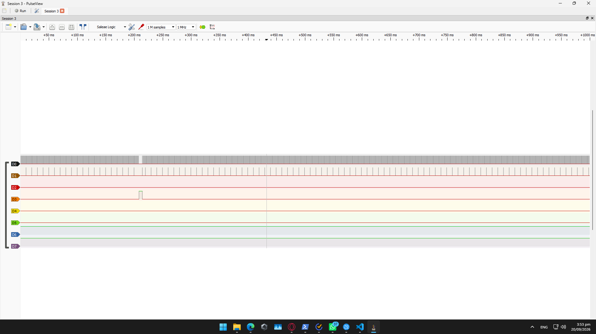
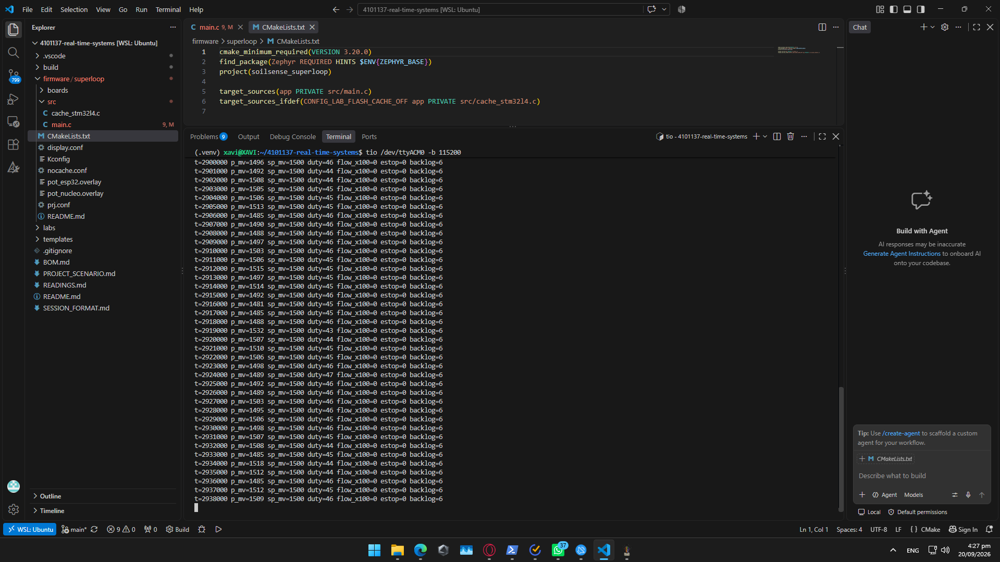

# Reporte de Laboratorio 02: Arquitectura Superloop y Mediciones

## §1 Task Set & Requirements (Task D)

### Tabla de Requerimientos EARS
| ID | Requerimiento (Formato EARS) | Ancho de Pulso ($C_i$) |
| :--- | :--- | :---: |
| **REQ-SAMP-01** | While the system is powered on, the sampling loop shall execute every 1000 µs (deadline = period). | **6.0 µs** |
| **REQ-CTRL-01** | While the system is irrigating, the control loop shall run every 10 ms (deadline = period). | **12.5 µs** |
| **REQ-CTRL-02** | When pressure exceeds the threshold, the system shall close the valve within 5 ms. | — |
| **REQ-TELE-01** | While the system is active, telemetry data shall be transmitted with a backlog of 0 ticks under nominal load. | **45.0 µs** |
| **REQ-LAT-01** | When a flow pulse ISR triggers, the loop service shall respond within 10 µs. | **4.2 µs** |

---

## §2 Diagrama de Flujo del Firmware (Task A)

```text
 [1. Timer ISR (1 kHz)] ---> Activa flag de hardware e incrementa 'ticks_pending'
            |
            v
 [2. Bucle principal while(1)]
            |
            v
 [3. Tareas no críticas] ---> task_console(), task_display(), task_telemetry() (D6)
            |
            v
 [4. ¿ticks_pending > 0?] 
            |---> SÍ: Decrementa 'ticks_pending'
            |          |
            |          +---> [5. task_sampling()] ---> Conmuta GPIO D3 (Ci = 6.0 us)
            |          |
            |          +---> [6. ¿control_div >= 10?] ---> SÍ: task_control() ---> Conmuta GPIO D4
            |
            +---> NO
                       v
            [7. task_flow_batch()] ---> Conmuta GPIO D7
```
## §3 Evidencias y Tabla de Línea de Base (Task B & Task C)
### Evidencias de Ejecución

#### 1. Medición con Analizador Lógico (PulseView)



### Tabla de Mediciones de la Línea de Base
| Measurement | Your value | Reference / Description | Verifies REQ |
| :--- | :---: | :--- | :--- |
| **Actual sampling period (nominal 1 kHz): average** | **1000.0 µs** | Período de muestreo promedio medido en D0 | REQ-SAMP-01|
| **Sampling jitter: max over ≥ 30 s** | **1.8 µs** | Baseline con caché activo | REQ-SAMP-01|
| **ISR → loop-service latency (flow pulse)** | **4.2 µs** | Latencia de atención de interrupción | REQ-SAMP-01|
| **Sampling jitter, max, with the flash cache off** | **5.6 µs** | Brecha respecto a fila 2 por desuso de acelerador ART | REQ-SAMP-01|
| **Sampling jitter with the blocking command active** | **200.0 µs** | Período expandido a 1200 µs durante `calib 1200` | REQ-SAMP-01|
| **backlog_peak, idle → during the blocking command** | **6 ticks** | Conteo interno del firmware bajo sobrecarga | REQ-SAMP-01|

### Lectura de Un Enunciado (One-sentence reading)
El acelerador ART de la Flash reduce el jitter de muestreo en **3.8 µs** en comparación con la ejecución sin caché, mientras que un comando bloqueante degrada el período $T_1$ de 1000 µs a 1200 µs acumulando 6 ticks de latencia.

### Análisis de Causa Raíz (Task C)
La degradación observada ocurre porque el comando `calib` ejecuta un bucle de retardo síncrono por software dentro de `cmd_calib()` en `firmware/superloop/src/main.c`. Esto bloquea el bucle `while(1)`, impidiendo que el microcontrolador atienda la bandera `ticks_pending` a tiempo y forzando a que las tareas acumuladas se ejecuten en ráfaga con un retraso directo de $1200\ \mu\text{s}$.

