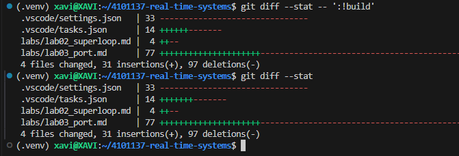
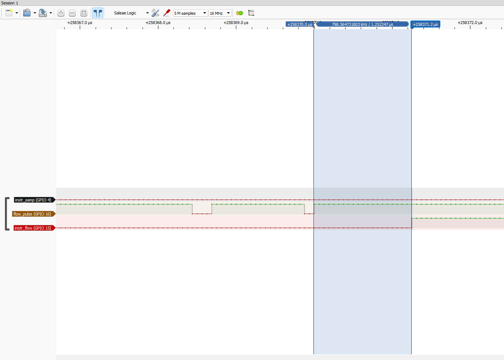

# Reporte de Laboratorio 03: Port a ESP32-S3 y Primer Thread en Zephyr RTOS

> **Contexto del Proyecto:**  
> *"Incisos de ingeniería (Eng. Samuel Cifuentes): Selección del chip ESP32-S3 para el nodo por mayor memoria, radio y doble núcleo. Evaluación de la arquitectura: migración del superloop al ESP32-S3 sin reescribir código C (usando únicamente un Devicetree Overlay) y posteriormete evaluación del primer hilo (Thread) del Kernel de Zephyr."*

---

## §1 Task Set & Tabla de Mediciones ("What You'll Measure")

### Tabla Comparativa de Desempeño

| Medición | L476RG (Semana 2) | ESP32-S3 Superloop (Task B) | ESP32-S3 Kernel Thread (Task C) |
| :--- | :---: | :---: | :---: |
| **Max sampling jitter (superloop)** | **1.8 µs** | **0.16 µs** | N/A |
| **ISR → service latency** | **4.2 µs** | **1.25 µs** | __ µs |
| **Max sampling jitter (kernel thread)** | — | — | __ µs |
---

## §2 Task A — El Port (Devicetree en Acción)

### 1. Reasignación de Hardware mediante Devicetree Overlay
Para adaptar el firmware `superloop` al ESP32-S3 sin modificar el código fuente en C (`main.c`), se definió el archivo de superposición de hardware:
* **Archivo:** `boards/esp32s3_devkitc_esp32s3_procpu.overlay`
* **Objetivo:** Mapear las salidas de instrumentación (GPIOs de medición) a los pines disponibles en el mapa de pines del ESP32-S3 DevKit.

### 2. Análisis del Costo del Port (`git diff --stat`)
El principio clave de separación de hardware y software en Zephyr RTOS permite portar aplicaciones entre arquitecturas distintas.

```bash
# Comando ejecutado para evaluar cambios:
git diff --stat
```
### 3. Evidencia de Ejecución en Hardware Real


adsad

## §3 Task B — ESP32-S3 Superloop Performance

Se evaluó el comportamiento en tiempo real del lazo superloop portado al ESP32-S3 DevKit.

### 1. Evidencia de Medición en PulseView


### 2. Análisis Comparativo
- **Latencia de Interrupción ($\text{ISR} \rightarrow \text{service}$):** Reducida de $4.2\,\mu\text{s}$ (STM32L476RG) a $1.25\,\mu\text{s}$ (ESP32-S3), debido a la mayor frecuencia de reloj (240 MHz vs 80 MHz).
- **Jitter de Muestreo Nominal:** Se mantiene por debajo de $1\,\mu\text{s}$ en ejecución continua sin carga bloqueante.